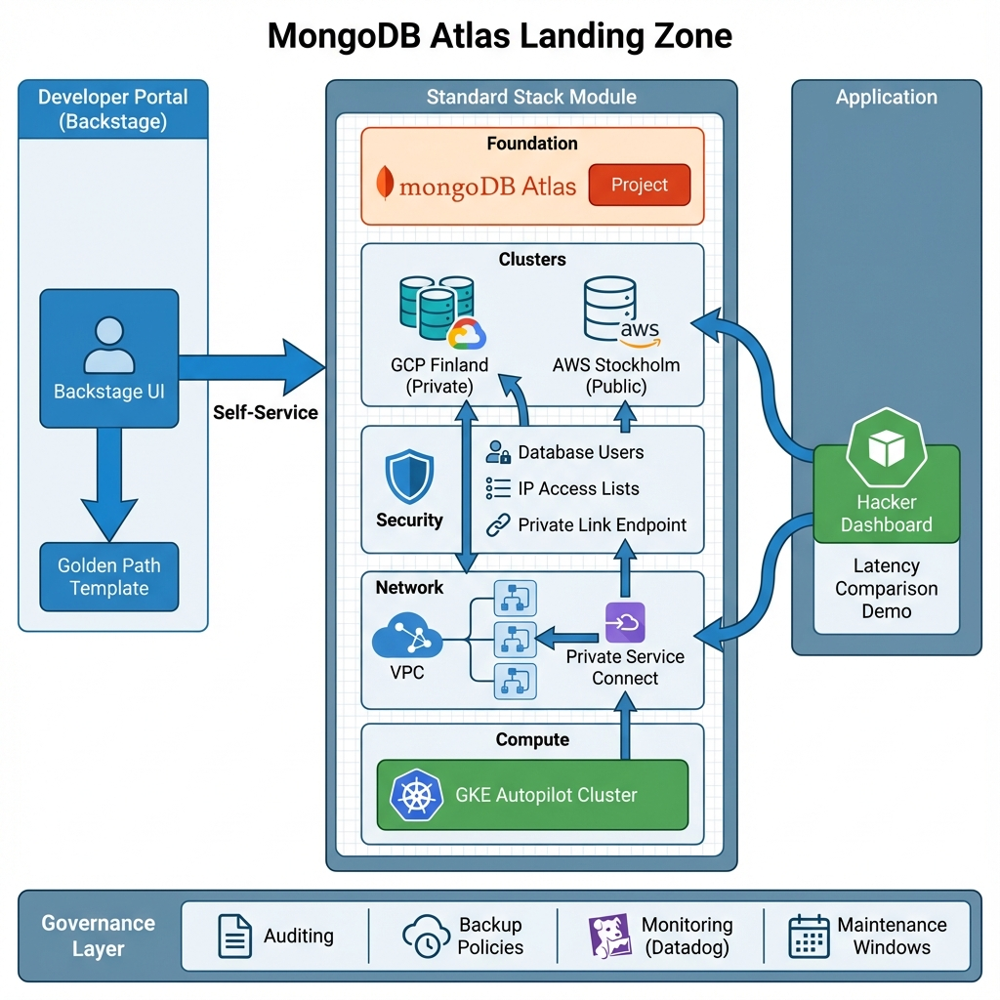
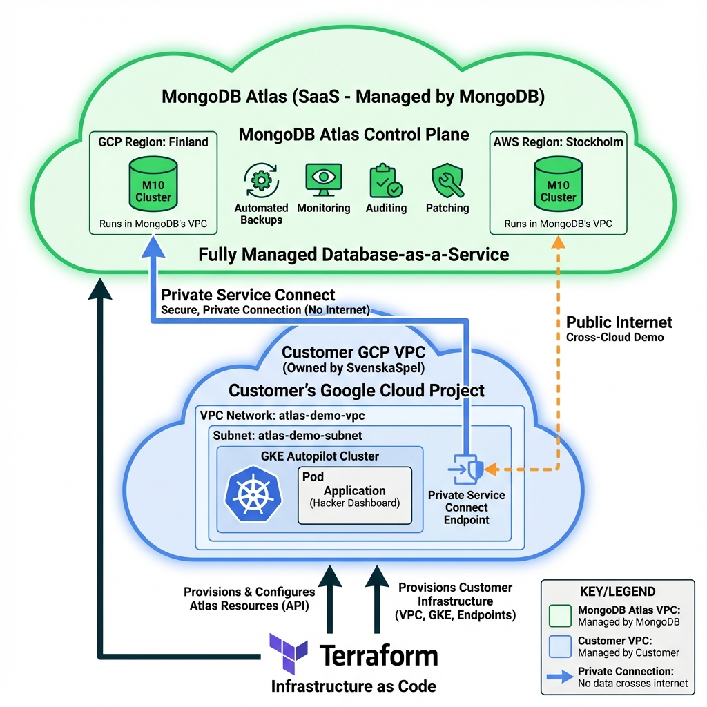

# MongoDB Atlas Landing Zone - Demo



## 🎯 Project Purpose

This repository demonstrates a **production-ready MongoDB Atlas Landing Zone** that enables organizations to:

1. **Standardize Infrastructure**: Deploy MongoDB Atlas clusters using a "Golden Path" approach with pre-approved, secure configurations
2. **Enable Self-Service**: Empower developers to provision databases through Backstage without learning Terraform or opening tickets
3. **Ensure Compliance**: Automatically enforce security policies, backup schedules, auditing, and governance controls
4. **Reduce Operational Burden**: Eliminate manual database operations through Infrastructure as Code and MongoDB's fully managed SaaS

**Key Technologies:**
- **MongoDB Atlas**: Fully managed database-as-a-service (SaaS)
- **Terraform**: Infrastructure as Code for consistent, repeatable deployments
- **Backstage**: Developer portal for self-service infrastructure provisioning
- **Google Kubernetes Engine (GKE)**: Container orchestration for application workloads
- **Private Service Connect**: Secure, private connectivity between GCP and MongoDB Atlas

## 📐 Architecture Explained

The diagram above illustrates the complete "Golden Path" architecture:

### Left: Developer Experience (Backstage Portal)
- **Backstage UI**: Self-service interface where developers request infrastructure
- **Golden Path Template**: Pre-configured form with guardrails (approved regions, cluster sizes, security settings)
- **Self-Service Flow**: Developers fill out a form → Backstage generates Terraform code → Creates Pull Request for review

### Center: Infrastructure (Terraform Standard Stack)
The `standard-stack` module encapsulates all infrastructure components:

**Foundation Layer:**
- MongoDB Atlas Project creation
- Organizational policies and settings

**Cluster Layer:**
- **GCP Finland (Private)**: M10 cluster with private endpoint connectivity
- **AWS Stockholm (Public)**: M10 cluster for cross-cloud latency comparison

**Security Layer:**
- Database users with auto-generated passwords
- IP access lists (restrictive for production, open for demo)
- Private Link Endpoint for secure GCP connectivity

**Network Layer:**
- GCP VPC and subnets
- Private Service Connect (50 forwarding rules to Atlas)
- No internet exposure for database traffic

**Compute Layer:**
- GKE Autopilot cluster (fully managed Kubernetes)
- Workload Identity for secure service account binding

### Right: Application Layer
- **Hacker Dashboard**: Node.js application demonstrating dual-cluster connectivity
- **Latency Comparison**: Real-time ping tests showing private vs public endpoint performance
- **Credential Injection**: Kubernetes secrets automatically populated by Terraform

### Bottom: Governance Layer
Automatically enforced policies:
- **Auditing**: All database access logged for compliance
- **Backup Policies**: Continuous backup + daily/weekly/monthly snapshots
- **Monitoring**: Datadog integration for metrics and alerts
- **Maintenance Windows**: Scheduled updates during off-peak hours (Sunday 02:00 UTC)

## 🏗️ Deployment Architecture

### High-Level Deployment

This Landing Zone demonstrates how to connect customer workloads to MongoDB Atlas (a fully managed SaaS) using secure private connectivity.



**Infrastructure Ownership:**

| Component | Managed By | Location |
|-----------|------------|----------|
| MongoDB Atlas Clusters | MongoDB (SaaS) | MongoDB's VPC in GCP/AWS |
| Backups, Monitoring, Patching | MongoDB (SaaS) | Atlas Control Plane |
| Customer VPC & Subnets | Customer (SvenskaSpel) | Customer's GCP Project |
| GKE Autopilot Cluster | Customer (SvenskaSpel) | Customer's GCP Project |
| Application Workloads | Customer (SvenskaSpel) | Runs in Customer's GKE |
| Private Service Connect Endpoint | Customer (SvenskaSpel) | Customer's VPC |

**Key Points:**
- **MongoDB Atlas is SaaS**: Database clusters run in MongoDB-managed VPCs, not in your VPC
- **Private Connectivity**: Private Service Connect creates a secure tunnel from your VPC to Atlas (no internet exposure)
- **Zero Database Operations**: MongoDB handles all patching, backups, monitoring, and scaling
- **Customer Controls Application**: You manage your GKE cluster and application deployment

### Detailed Architecture


**The "Golden Path" Pattern:**
1. **Developer Portal (Backstage)**: Self-service interface for developers to request infrastructure
2. **Standard Stack Module**: Reusable Terraform module containing all best practices
3. **Application Layer**: Kubernetes workloads with automated credential injection
4. **Governance Layer**: Built-in auditing, backups, monitoring, and maintenance policies

This architecture ensures:
- ✅ **Consistency**: All deployments use the same tested configuration
- ✅ **Security**: Private endpoints, automated credential management, IP access controls
- ✅ **Compliance**: Auditing, backup policies, and maintenance windows enforced
- ✅ **Self-Service**: Developers can provision infrastructure without manual intervention

## 📋 Prerequisites

Before the workshop, ensure you have the following prepared:

1.  **MongoDB Atlas Account:**
    *   Access to an Atlas Organization with "Organization Owner" or "Project Creator" permissions.
    *   **API Keys:** Create a Public/Private API Key pair at the Organization level.
        *   *Permissions:* Organization Owner (required for creating Projects).
        *   *Allowlist:* Add your current IP address.

2.  **Google Cloud Platform (GCP):**
    *   A GCP Project to host the Private Endpoint and Service Accounts.
    *   `gcloud` CLI installed and authenticated.

3.  **Tools:**
    *   [Terraform](https://developer.hashicorp.com/terraform/install) (v1.0+)
    *   [kubectl](https://kubernetes.io/docs/tasks/tools/) (Optional, for K8s demo)

## 🚀 Quick Start

### 1. Automated Setup (Recommended)
Run the helper script to check tools and configure credentials:

```bash
cd scripts
./setup.sh
source .env
```

### 2. Manual Setup
If you prefer to configure manually:
Export your Atlas API keys as environment variables to avoid hardcoding them:

```bash
export TF_VAR_atlas_public_key="your_public_key"
export TF_VAR_atlas_private_key="your_private_key"
export TF_VAR_atlas_org_id="your_org_id"
export TF_VAR_gcp_project_id="your_gcp_project_id"
export GITHUB_TOKEN="your_github_token" # Required for Backstage Scaffolder
```

### 3. Terraform Demo ("Part-by-Part")
The Terraform code is designed to be uncommented in stages.

1.  Navigate to the directory:
    ```bash
    cd terraform
    ```
2.  Initialize Terraform:
    ```bash
    terraform init
    ```
3.  **Part 1 (Foundation):** Run `terraform apply`. This creates the Project.
4.  **Part 2 (Cluster):** Uncomment the `module "cluster"` block in `main.tf` and run `terraform apply`.
5.  **Part 3 (Security):** Uncomment `module "security"` and apply.
6.  **Part 4 (Advanced):** Uncomment `module "advanced"` and apply.
7.  **Part 5 (Integrations):** Uncomment `module "integrations"` and apply.
8.  **Part 6 (Sharding):** Uncomment `module "sharding"` and apply.

### 3. Backstage Demo (The "Golden Path")
Since we don't have a live Backstage instance, you will demonstrate the **Code & Process**:

1.  **Show the Template (`backstage/atlas-template.yaml`):**
    *   Explain that this file defines the UI form developers see in Backstage.
    *   Highlight the `parameters` section (Name, Region, Size) - this is how you enforce governance (e.g., only allowing specific regions).
    *   Show the `steps` section - specifically `fetch:template` and `publish:github:pull-request`.

2.  **Show the mongodb-atlas-landingzone (`backstage/mongodb-atlas-template/`):**
    *   Explain that this is the "Cookie Cutter" code.
    *   Open `main.tf` and show how variables like `var.project_name` are injected.
    *   Point out the "Best Practices" hardcoded here (e.g., `termination_protection`, `backup_enabled`) that developers get for free.

3.  **The Story:**
    *   "Developers don't write Terraform from scratch."
    *   "They fill out a form, Backstage creates a PR with this high-quality Terraform code."
    *   "Platform Engineers review the PR, merge it, and Atlantis/Terraform Cloud applies it."

### 4. Kubernetes Demo (The "Golden Path")
This is the core of the technical demo. It shows the end-to-end flow from Infrastructure to Application.

1.  **Provision Infrastructure:**
    ```bash
    cd terraform
    terraform apply
    ```
    *   This creates the GKE Cluster, Atlas Cluster, and the **Kubernetes Secret** (`atlas-creds`) containing the database credentials.

2.  **Deploy Application:**
    ```bash
    # Ensure you are in the project root
    cd .. 
    
    # Authenticate kubectl (if needed)
    gcloud container clusters get-credentials atlas-demo-cluster --region europe-north1 --project svenska-spel-demo
    
    # Deploy
    kubectl apply -f kubernetes/app-deployment.yaml
    ```

3.  **Verify:**
    *   Get the External IP: `kubectl get service my-app-service`
    *   Open in Browser.
    *   Click "Log In" to verify the secure connection to MongoDB Atlas.

## 🎭 Running the Backstage Developer Portal

The Backstage portal provides a self-service interface for developers to provision MongoDB Atlas infrastructure using the "Golden Path" template.

### Prerequisites
- Node.js 20 or 22
- Yarn package manager
- GitHub Personal Access Token (for scaffolder)

### Starting Backstage

1. **Navigate to the Backstage directory:**
   ```bash
   cd backstage/developer-portal
   ```

2. **Install dependencies (first time only):**
   ```bash
   yarn install
   ```

3. **Configure environment variables:**
   ```bash
   # Required for Node.js 20+
   export NODE_OPTIONS=--no-node-snapshot
   
   # Required for GitHub integration
   export GITHUB_TOKEN="your_github_token"
   ```

4. **Configure GitHub token in Backstage:**
   Create or update `app-config.local.yaml`:
   ```yaml
   integrations:
     github:
       - host: github.com
         token: ${GITHUB_TOKEN}
   ```

4. **Start the development server:**
   ```bash
   yarn start
   ```

5. **Access the portal:**
   Open your browser to: **http://localhost:3000**

### Using the MongoDB Atlas Template

1. In Backstage, navigate to **Create** → **Choose a template**
2. Select **"MongoDB Atlas Cluster"**
3. Fill in the form:
   - **Project Name**: Name for your Atlas project
   - **Region**: Choose from available regions (e.g., Finland, Stockholm)
   - **Cluster Size**: M10, M20, M30, etc.
4. Click **Create**
5. Backstage will:
   - Generate Terraform code from the `mongodb-atlas-template`
   - Create a Pull Request in your GitHub repository
   - Include all best practices (backups, security, monitoring)

### What Gets Created

The template uses the `standard-stack` module to provision:
- MongoDB Atlas Project
- Cluster with your specified configuration
- Private endpoint connectivity
- Database users with secure passwords
- IP access lists
- Backup policies
- Monitoring integration

All infrastructure follows the "Golden Path" - pre-approved, secure, compliant configuration.

## 📚 Detailed Documentation

### Key Features

- **[Database User Management](docs/database-users.md)**
  - How database users are created and managed
  - Credential injection into Kubernetes
  - Security best practices and rotation procedures
  - Troubleshooting authentication issues

- **[Private Endpoint Configuration](docs/private-endpoints.md)**
  - Why use private endpoints (security, performance, cost)
  - Architecture and implementation details
  - Connection string differences
  - Latency comparison and verification
  - Troubleshooting connectivity issues

- **[Backup Policies and Disaster Recovery](docs/backup-policies.md)**
  - Continuous cloud backup (oplog-based)
  - Snapshot schedules (daily, weekly, monthly)
  - Point-in-time recovery procedures
  - RTO/RPO targets and compliance
  - Cost optimization strategies

- **[Governance and Compliance](docs/governance.md)**
  - Auditing configuration and use cases
  - Maintenance windows and update policies
  - IP access lists and network security
  - Monitoring integration (Datadog)
  - Encryption at rest and in transit
  - Compliance certifications (SOC 2, GDPR, HIPAA)

### Additional Resources

- **`talk_track.md`**: Presentation script for customer demos
- **`terraform/`**: Infrastructure as Code implementation
- **`backstage/`**: Self-service developer portal
- **`kubernetes/`**: Application deployment manifests

## 📚 Documentation
*   **`talk_track.md`**: **START HERE.** The script for presenting this demo.
# mongodb-atlas-landing-zone
